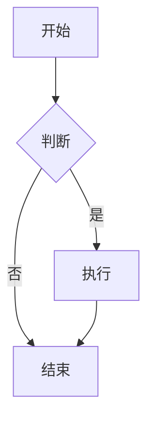

# Chirpy 主题使用说明（中文完整版）

本文档基于 Chirpy 官方文档翻译整理，包含四个主要教程的完整内容。

---

## 一、入门指南 (Getting Started)

本指南提供了 Chirpy 的基础概述，您将学习如何安装、配置和使用您的第一个基于 Chirpy 的网站，以及如何将其部署到 Web 服务器。

### 创建站点仓库

在创建站点仓库时，根据您的需求有两种选项：

#### 选项 1：使用 Starter（推荐）

此方法简化了升级过程，隔离了不必要的文件，非常适合希望专注于写作且最小化配置的用户。

**步骤**：
1. 登录 GitHub 并导航至 [starter](https://github.com/cotes2020/chirpy-starter)。
2. 点击 "Use this template" 按钮，然后选择 "Create a new repository"。
3. 将新仓库命名为 `<username>.github.io`，其中 `username` 替换为您的小写 GitHub 用户名。

#### 选项 2：Fork 主题

此方法方便修改功能或 UI 设计，但在升级时可能会遇到挑战。因此，除非您熟悉 Jekyll 并计划大量修改此主题，否则不建议使用此方法。

**步骤**：
1. 登录 GitHub。
2. [Fork 主题仓库](https://github.com/cotes2020/jekyll-theme-chirpy)。
3. 将新仓库命名为 `<username>.github.io`，其中 `username` 替换为您的小写 GitHub 用户名。

### 设置开发环境

创建仓库后，需要设置开发环境。主要有两种方法：

#### 使用 Dev Containers（推荐用于 Windows）

Dev Containers 提供了一个使用 Docker 的隔离环境，防止与您的系统发生冲突，并确保所有依赖项都在容器内管理。

**步骤**：
1. 安装 Docker：
   - 在 Windows/macOS 上，安装 [Docker Desktop](https://www.docker.com/products/docker-desktop)。
   - 在 Linux 上，安装 [Docker Engine](https://docs.docker.com/engine/install/)。
2. 安装 [VS Code](https://code.visualstudio.com/) 和 [Dev Containers 扩展](https://marketplace.visualstudio.com/items?itemName=ms-vscode-remote.remote-containers)。
3. 克隆您的仓库：
   - 对于 Docker Desktop：启动 VS Code，并在容器卷中克隆您的仓库。
   - 对于 Docker Engine：在本地克隆您的仓库，然后通过 VS Code 在容器中打开它。
4. 等待 Dev Containers 设置完成。

#### 本地设置（推荐用于类 Unix 系统）

对于类 Unix 系统，您可以本地设置环境以获得最佳性能，当然也可以选择使用 Dev Containers。

**步骤**：
1. 按照 [Jekyll 安装指南](https://jekyllrb.com/docs/installation/) 安装 Jekyll，并确保已安装 [Git](https://git-scm.com/)。
2. 将您的仓库克隆到本地机器。
3. 如果您 fork 了主题，安装 [Node.js](https://nodejs.org/) 并在根目录运行 `bash tools/init.sh` 来初始化仓库。
4. 在仓库的根目录运行 `bundle` 命令以安装依赖项。

### 使用方法

#### 启动 Jekyll 服务器

要在本地运行站点，使用以下命令：

```bash
$ bundle exec jekyll serve
```

> 如果您使用 Dev Containers，必须在 **VS Code** 终端中运行该命令。

几秒钟后，本地服务器将在 http://127.0.0.1:4000 可用。

#### 配置

根据需要更新 `_config.yml` 中的变量。一些常见的选项包括：

- `url`
- `avatar`
- `timezone`
- `lang`

#### 社交联系选项

社交联系选项显示在侧边栏底部。您可以在 `_data/contact.yml` 文件中启用或禁用特定的联系方式。

#### 自定义样式表

要自定义样式表，将主题的 `assets/css/jekyll-theme-chirpy.scss` 文件复制到您 Jekyll 站点的相同路径，并在文件末尾添加您的自定义样式。

#### 自定义静态资源

静态资源配置在版本 `5.1.0` 中引入。静态资源的 CDN 在 `_data/origin/cors.yml` 中定义。您可以根据网站发布地区的网络状况替换其中的一些资源。

如果您更喜欢自托管静态资源，请参考 [chirpy-static-assets](https://github.com/cotes2020/chirpy-static-assets) 仓库。

### 部署

在部署之前，检查 `_config.yml` 文件，确保 `url` 配置正确。如果您更喜欢**项目站点**且不使用自定义域，或者如果希望在除 **GitHub Pages** 以外的 Web 服务器上访问您的网站，请记得将 `baseurl` 设置为您的项目名称，以斜杠开头，例如 `/project-name`。

现在，您可以选择**以下方法之一**来部署您的 Jekyll 站点。

#### 使用 GitHub Actions 部署

**准备**：
- 如果您使用的是 GitHub Free 计划，请保持您的站点仓库为**公开**。
- 如果您已将 `Gemfile.lock` 提交到仓库，并且您的本地机器未运行 Linux，请更新锁文件的平台列表：

```bash
$ bundle lock --add-platform x86_64-linux
```

接下来，配置 Pages 服务：

1. 在 GitHub 上进入您的仓库。选择 **Settings** 选项卡，然后点击左侧导航栏中的 **Pages**。在 **Source** 部分（位于 **Build and deployment** 下方），从下拉菜单中选择 **GitHub Actions**。
2. 向 GitHub 推送任何提交以触发 **Actions** 工作流。在仓库的 **Actions** 选项卡中，您应该看到工作流 _Build and Deploy_ 正在运行。构建完成且成功后，站点将自动部署。

现在，您可以访问 GitHub 提供的 URL 来访问您的站点。

#### 手动构建和部署

对于自托管服务器，您需要在本地机器上构建站点，然后将站点文件上传到服务器。

导航到源项目的根目录，使用以下命令构建您的站点：

```bash
$ JEKYLL_ENV=production bundle exec jekyll b
```

除非您指定了输出路径，否则生成的站点文件将放置在项目根目录的 `_site` 文件夹中。将这些文件上传到您的目标服务器。

---

## 二、文本和排版 (Text and Typography)

本文展示了文本、排版、数学公式、图表、流程图、图片、视频等的示例。

### 标题

```markdown
# H1 — 标题

## H2 — 标题

### H3 — 标题

#### H4 — 标题
```

### 段落

段落文本示例。

### 列表

#### 有序列表

```markdown
1. 首先
2. 其次
3. 第三
```

#### 无序列表

```markdown
- 章节
  - 部分
    - 段落
```

#### 待办事项列表

```markdown
- [ ] 任务 1
  - [ ] 步骤 1
  - [ ] 步骤 2
  - [ ] 步骤 3
```

#### 描述列表

```markdown
术语
: 定义
```

### 引用块

```markdown
> 这是一行引用块。
```

### 提示框 (Prompts)

Chirpy 主题支持多种提示框样式：

```markdown
{: .prompt-tip }

{: .prompt-info }

{: .prompt-warning }

{: .prompt-danger }
```

### 代码块

#### 行内代码

```markdown
`行内代码`
```

#### 代码块

带语法高亮的代码块：

````markdown
```python
def hello():
    print("Hello, World!")
```
````

### 数学公式

使用 LaTeX 语法编写数学公式：

```markdown
行内公式：$E = mc^2$

块级公式：
$$
\int_{-\infty}^{\infty} e^{-x^2} dx = \sqrt{\pi}
$$
```

### 图表

#### Mermaid 图表

```markdown

```
```

### 图片

```markdown

```

### 视频

支持的视频格式和嵌入方式。

### 表格

```markdown
| 列 1 | 列 2 | 列 3 |
|------|------|------|
| 行 1 | 数据 | 数据 |
| 行 2 | 数据 | 数据 |
```

---

## 三、自定义网站图标 (Customize the Favicon)

Chirpy 的 favicon 放置在 `assets/img/favicons/` 目录中。您可能想要用自己的图标替换它们。以下部分将指导您创建和替换默认的 favicon。

### 步骤

1. **准备图标源文件**
   - 准备一张正方形图片，建议尺寸为 512x512 像素或更大
   - 格式可以是 PNG、JPG 或 SVG

2. **使用在线工具生成 Favicon**
   - 访问 [Real Favicon Generator](https://realfavicongenerator.net/)
   - 上传您的图标图片
   - 根据需要调整选项（或保持默认）
   - 生成并下载图标包

3. **下载并替换文件**
   - 解压下载的文件
   - **删除 `site.webmanifest` 文件**（重要：Chirpy 不使用此文件）
   - 将剩余的图标文件（如 `.PNG`、`.ICO` 和 `.SVG`）复制到您网站的 `assets/img/favicons/` 目录中

4. **验证**
   - 运行本地服务器查看效果
   - 检查浏览器标签页是否显示新图标

### 文件位置

- 目标目录：`assets/img/favicons/`
- 如果目录不存在，需要创建它

---

## 四、撰写新文章 (Writing a New Post)

本教程将指导您如何在 Chirpy 模板中撰写文章，即使您之前使用过 Jekyll，也值得阅读，因为许多功能需要设置特定的变量。

### 命名和路径

- 文件名格式：`YYYY-MM-DD-标题.md`
- 例如：`2024-01-15-getting-started.md`
- 文件应放在 `_posts/` 目录下

### 前置数据 (Front Matter)

每篇文章都需要前置数据（front matter），位于文件开头：

```yaml
---
title: 文章标题
date: 2024-01-15
categories: [分类1, 分类2]
tags: [标签1, 标签2]
math: true  # 启用数学公式
mermaid: true  # 启用 Mermaid 图表
---
```

### 常用前置数据字段

- `title`: 文章标题
- `date`: 发布日期（格式：YYYY-MM-DD）
- `last_modified_at`: 最后修改日期（可选）
- `categories`: 分类数组
- `tags`: 标签数组
- `author`: 作者（可选，默认使用 `site.social.name`）
- `math`: 是否启用数学公式渲染（true/false）
- `mermaid`: 是否启用 Mermaid 图表（true/false）
- `toc`: 是否显示目录（true/false，可覆盖全局设置）
- `comments`: 是否启用评论（true/false，可覆盖全局设置）
- `image`: 社交预览图片（可选，覆盖全局 `social_preview_image`）
- `pin`: 是否置顶（true/false）

### 置顶文章

要置顶文章，在前置数据中添加：

```yaml
pin: true
```

### 提示框

在文章中使用提示框：

```markdown
> 提示内容
{: .prompt-tip }

> 信息内容
{: .prompt-info }

> 警告内容
{: .prompt-warning }

> 危险内容
{: .prompt-danger }
```

### 语法高亮

代码块支持多种语言的语法高亮：

````markdown
```python
def hello():
    print("Hello, World!")
```

```javascript
console.log("Hello, World!");
```
````

### Mermaid 图表

启用 Mermaid 后，可以在文章中使用图表：

````markdown

````

### 数学公式

启用数学支持后，可以使用 LaTeX 语法：

```markdown
行内公式：$E = mc^2$

块级公式：
$$
\int_{-\infty}^{\infty} e^{-x^2} dx = \sqrt{\pi}
$$
```

### 图片

```markdown

```

或使用 HTML：

```html

```

### 文章摘要

在首页显示的文章摘要可以通过以下方式设置：

1. 在 `_config.yml` 中设置 `paginate` 控制显示数量
2. 文章中的 `<!--more-->` 标记之前的文字会作为摘要显示

### 永久链接

文章的永久链接格式在 `_config.yml` 中定义：

```yaml
permalink: /posts/:title/
```

这意味着文章的 URL 将是：`https://yoursite.com/posts/文章标题/`

---

## 配置文件说明

### `_config.yml` 主要配置项

#### 网站基本信息
- `title`: 网站主标题
- `tagline`: 网站副标题/标语
- `description`: SEO 描述
- `url`: 网站 URL（不以斜杠结尾）
- `baseurl`: 基础 URL（项目站点使用）
- `timezone`: 时区设置
- `lang`: 网站语言

#### 个人信息
- `github.username`: GitHub 用户名
- `twitter.username`: Twitter/X 用户名
- `social.name`: 个人全名（默认作者和版权所有者）
- `social.email`: 邮箱地址
- `social.links`: 社交媒体链接列表

#### 头像和图标
- `avatar`: 侧边栏头像路径（本地路径或 CORS 资源）
- `social_preview_image`: SEO 社交预览图片

#### 其他设置
- `theme_mode`: 主题模式（light/dark，留空跟随系统）
- `toc`: 全局目录开关
- `comments.provider`: 评论系统（disqus/utterances/giscus）
- `analytics`: 分析工具配置
- `paginate`: 分页数量

### `_data/contact.yml` 联系方式配置

在文件中启用或禁用联系方式：

```yaml
- type: github
  icon: "fab fa-github"

- type: twitter
  icon: "fa-brands fa-x-twitter"

- type: email
  icon: "fas fa-envelope"
  noblank: true  # 在当前标签页打开
```

---

## 常见问题

### Q: 如何本地预览网站？

A: 运行 `bundle exec jekyll serve`，然后访问 http://127.0.0.1:4000

### Q: 如何修改网站名称？

A: 编辑 `_config.yml` 中的 `title` 和 `tagline` 字段

### Q: 如何添加个人头像？

A: 将头像图片放在 `assets/img/` 目录，然后在 `_config.yml` 中设置 `avatar` 字段

### Q: 如何创建 favicon？

A: 使用 Real Favicon Generator 生成图标，然后放到 `assets/img/favicons/` 目录

### Q: 文章支持哪些格式？

A: 支持 Markdown 格式，包括代码高亮、数学公式、Mermaid 图表等

### Q: 如何部署到 GitHub Pages？

A: 使用 GitHub Actions 部署（推荐）或手动构建后上传 `_site` 文件夹

---

## 相关链接

- [Chirpy 主题仓库](https://github.com/cotes2020/jekyll-theme-chirpy)
- [Chirpy Starter 模板](https://github.com/cotes2020/chirpy-starter)
- [Jekyll 官方文档](https://jekyllrb.com/docs/)
- [Real Favicon Generator](https://realfavicongenerator.net/)

---

*最后更新：基于 Chirpy 主题最新文档翻译整理*

