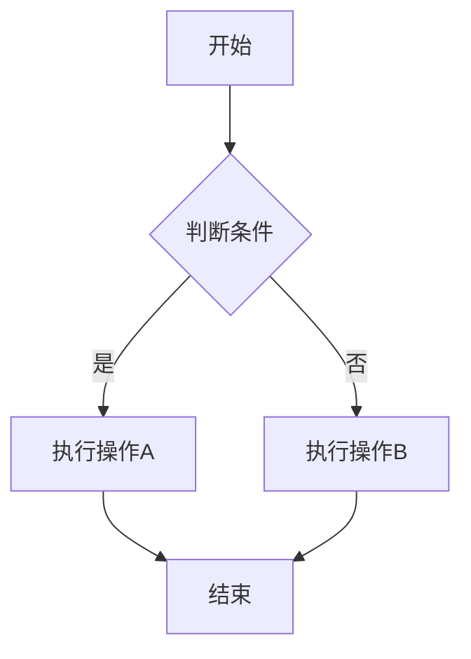
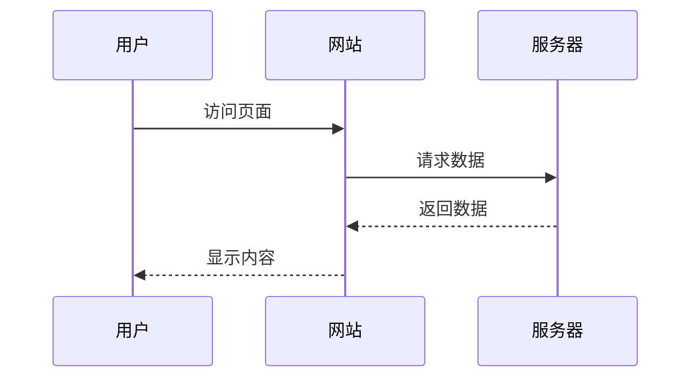

这是一篇**完整的示例文章**，展示了 Chirpy 主题中所有可用的前置数据字段和功能。

<!--more-->

> 这是文章摘要部分。在首页显示的文章摘要可以通过 `<!--more-->` 标记之前的文字来设置。
{: .prompt-tip }

## 文章内容示例

### 标题层次结构

文章使用了标准的 Markdown 语法，支持多级标题。

#### H4 标题示例

这是一个四级标题的示例。

### 提示框示例

Chirpy 主题支持多种提示框样式：

> 这是一个提示（Tip）框
{: .prompt-tip }

> 这是一个信息（Info）框
{: .prompt-info }

> 这是一个警告（Warning）框
{: .prompt-warning }

> 这是一个危险（Danger）框
{: .prompt-danger }

### 代码块示例

#### 行内代码

使用 `` `代码` `` 来显示行内代码。

#### 代码块

带语法高亮的代码块：

```python
# 这是 Python 代码示例
def hello_world():
    """示例函数"""
    print("Hello, World!")
    return "success"

if __name__ == "__main__":
    hello_world()
```

```javascript
// 这是 JavaScript 代码示例
function greet(name) {
    console.log(`Hello, ${name}!`);
}

greet("Chirpy");
```

### 数学公式示例

由于设置了 `math: true`，我们可以在文章中使用数学公式。

#### 行内公式

爱因斯坦的质能方程：$E = mc^2$

#### 块级公式

高斯积分：
$$
\int_{-\infty}^{\infty} e^{-x^2} dx = \sqrt{\pi}
$$

勾股定理：
$$
a^2 + b^2 = c^2
$$

### Mermaid 图表示例

由于设置了 `mermaid: true`，我们可以在文章中使用 Mermaid 图表。





### 列表示例

#### 有序列表

1. 第一项
2. 第二项
3. 第三项

#### 无序列表

- 章节一
  - 部分 1.1
    - 小节 1.1.1
  - 部分 1.2
- 章节二
- 章节三

#### 待办事项列表

- [x] 已完成的任务 1
- [x] 已完成的任务 2
- [ ] 待完成的任务 3
  - [ ] 子任务 3.1
  - [ ] 子任务 3.2

#### 描述列表

Jekyll
: 一个静态网站生成器

Chirpy
: 一个基于 Jekyll 的博客主题

GitHub Pages
: 免费的静态网站托管服务

### 表格示例

| 字段名 | 作用 | 是否必需 |
|--------|------|---------|
| title | 文章标题 | 是 |
| date | 发布日期 | 是 |
| categories | 分类 | 否 |
| tags | 标签 | 否 |
| math | 启用数学公式 | 否 |
| mermaid | 启用图表 | 否 |

### 引用块示例

> 这是一个标准的引用块。可以用来引用其他人的话、重要信息或者强调某些内容。
> 
> 引用块可以包含多段文字。

### 图片示例

图片可以这样引用：

```markdown

```

或者使用 HTML：

```html

```

### 链接示例

- [Chirpy 主题仓库](https://github.com/cotes2020/jekyll-theme-chirpy)
- [Jekyll 官方文档](https://jekyllrb.com/docs/)
- [GitHub Pages](https://pages.github.com/)

### 水平分隔线

---

## 字段说明总结

### 必需字段

- **title**: 文章标题，必需
- **date**: 发布日期，必需，格式为 `YYYY-MM-DD` 或 `YYYY-MM-DD HH:MM:SS`

### 可选字段

- **last_modified_at**: 最后修改日期，用于显示"最后更新"时间
- **categories**: 分类数组，用于文章分类
- **tags**: 标签数组，用于标签系统
- **author**: 作者名称，默认使用配置文件中的设置
- **math**: 启用数学公式支持（LaTeX 语法）
- **mermaid**: 启用 Mermaid 图表支持
- **toc**: 控制是否显示文章目录
- **comments**: 控制是否启用评论功能
- **image**: 社交预览图片，用于社交媒体分享
- **pin**: 是否置顶文章

### 其他功能

- 使用 `<!--more-->` 标记来设置文章摘要
- 支持多种 Markdown 语法：标题、列表、表格、代码块等
- 支持多种提示框样式
- 支持数学公式和流程图

---

**注意**：本文档是一个完整的示例，展示了所有可用的字段和功能。在实际使用时，您可以根据需要选择性地使用这些字段。

